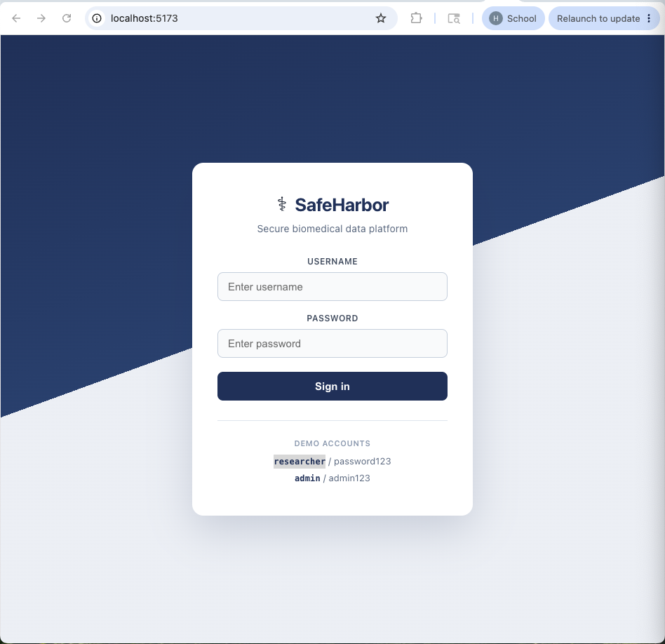

# SafeHarbor

**SafeHarbor — a secure, HIPAA-aligned platform for sharing biomedical datasets.**

SafeHarbor is a full-stack demonstration project that shows how governed access to sensitive biomedical data can work in practice. It combines JWT authentication, role-based authorization, dataset sensitivity tiers, HIPAA Safe Harbor de-identification, and audit logging behind a React dashboard. The platform is inspired by open biomedical data-sharing initiatives and uses **synthetic** patient records only—no real protected health information (PHI) is involved.

---

## Key Features

- **JWT-based authentication** — stateless login via `POST /auth/login`; all other API routes require a `Bearer` token.
- **Role-based access control** — two roles: `RESEARCHER` and `ADMIN`. Spring Security enforces access with `@PreAuthorize` and a JWT filter.
- **Dataset catalog with sensitivity tiers** — datasets carry a `sensitivity` label of `PUBLIC`, `RESTRICTED`, or `CONTROLLED` for governance visibility.
- **Safe Harbor de-identification** — researchers receive pseudo-IDs, birth year only, gender, and state; names, SSN, full dates, street address, city, and ZIP are stripped.
- **Audit logging** — patient data reads are recorded (username, action, resource, timestamp); admins can review the full audit trail.
- **React dashboard** — role-aware UI with login, dataset table, de-identified patient view, and admin-only raw PHI reveal and audit log.

---

## HIPAA Safeguard Mapping

| HIPAA Security Rule Safeguard | How SafeHarbor implements it |
|-------------------------------|------------------------------|
| **Access Control** | JWT authentication on every protected endpoint; `@PreAuthorize("hasRole('ADMIN')")` restricts raw PHI (`GET /patients`) and audit log (`GET /audit`) to admins; researchers receive HTTP 403 on those routes. |
| **Minimum Necessary** | Researchers see only de-identified patient fields via `GET /patients/deidentified`; dataset records are labeled by sensitivity tier (`PUBLIC` / `RESTRICTED` / `CONTROLLED`) so access expectations are explicit. |
| **De-identification (Safe Harbor)** | `DeidentificationService` removes direct identifiers: names and SSN are omitted; birth dates are reduced to year; street address, city, and ZIP are removed; state-level geography and a pseudonym (`P-{id}`) are retained. |
| **Audit Controls** | `AuditService` writes an entry on each patient read (`READ_DEIDENTIFIED` or `READ_RAW_PHI`) with username, action, resource, and timestamp; admins query entries via `GET /audit`. |

---

## Tech Stack

| Layer | Technologies |
|-------|--------------|
| **Backend** | Java 17, Spring Boot 3.5.15, Spring Security, Spring Data JPA / Hibernate, H2 (in-memory, dev), Maven, JJWT 0.12.6, OpenCSV 5.9 |
| **Frontend** | React 19, Vite 8 |
| **Data** | Synthea synthetic patient export (`src/main/resources/data/patients.csv`) |

---

## Data & Privacy

All patient records in SafeHarbor are **Synthea-generated synthetic data**. They are structurally similar to real EHR exports but do not represent real individuals. Synthea appends random digits to given and family names (e.g. `Margaretta466`, `Russel238`) and uses placeholder SSNs (`999-xx-xxxx`), making the synthetic origin obvious.

**Do not load real patient data into this project.** It is a local development demonstration with a hard-coded JWT secret, in-memory database, and no production hardening.

---

## API Endpoints

All endpoints except `/auth/login` require header `Authorization: Bearer <token>`.

| Method | Path | Access | Description |
|--------|------|--------|-------------|
| `POST` | `/auth/login` | Public | Authenticate with `{ "username", "password" }` → `{ "token", "role" }` |
| `GET` | `/datasets` | Any authenticated user | List datasets (`id`, `name`, `description`, `sensitivity`) |
| `GET` | `/patients/deidentified` | Any authenticated user | De-identified patients (`pseudoId`, `birthYear`, `gender`, `state`) |
| `GET` | `/patients` | `ADMIN` only | Raw patient records (`id`, `firstName`, `lastName`, `birthDate`, `gender`, `ssn`, `address`, `city`, `state`, `zip`) |
| `GET` | `/audit` | `ADMIN` only | Audit log entries (`id`, `username`, `action`, `resource`, `timestamp`) |

---

## Getting Started

### Prerequisites

- **Java 17**
- **Node.js** (for the frontend)

### 1. Run the backend

From the project root:

```bash
./mvnw spring-boot:run
```

Or run `safeharbor.SafeharborApplication` from your IDE.

On startup the server:

- Listens on **http://localhost:8080**
- Seeds demo users (`researcher` / `password123`, `admin` / `admin123`) and sample datasets
- Loads synthetic patients from `patients.csv` into the in-memory H2 database

### 2. Run the frontend

In a second terminal:

```bash
cd frontend
npm install
npm run dev
```

Open **http://localhost:5173** in your browser.

### Demo logins

| Username | Password | Role |
|----------|----------|------|
| `researcher` | `password123` | `RESEARCHER` — datasets + de-identified patients |
| `admin` | `admin123` | `ADMIN` — above plus raw PHI reveal and audit log |

---

## Screenshots

> Add screenshots to a `docs/` folder when ready.




